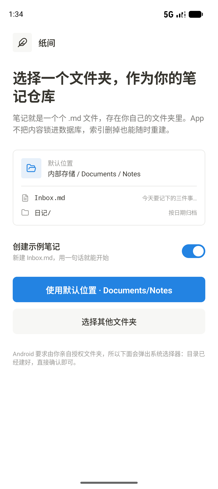
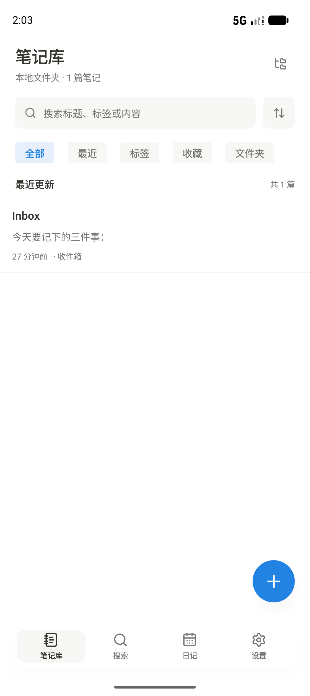
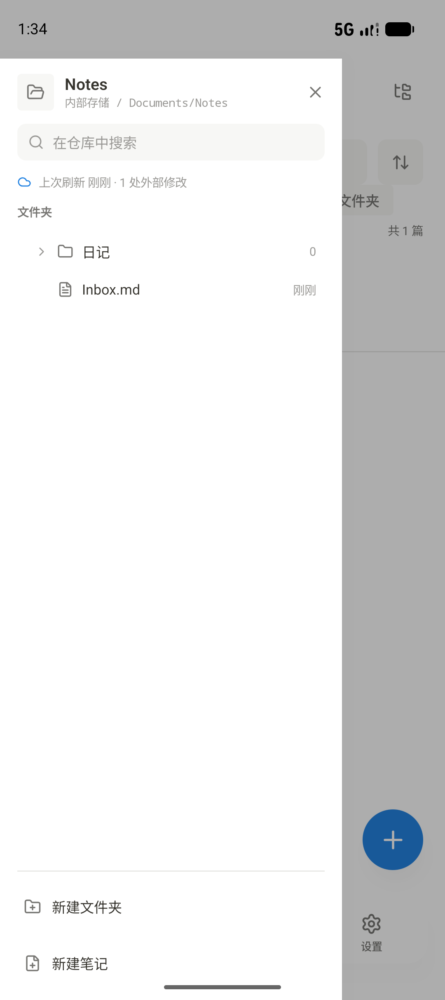
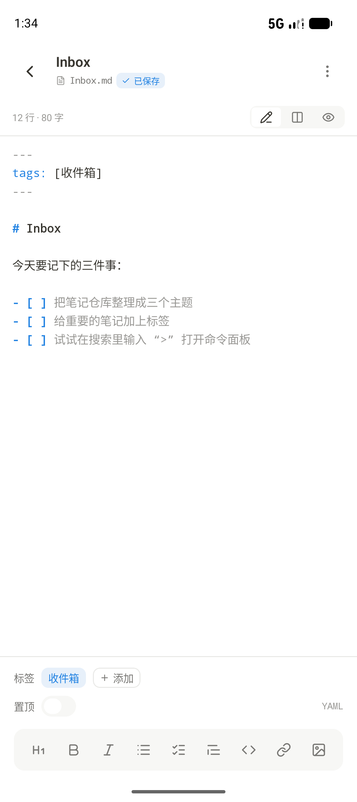
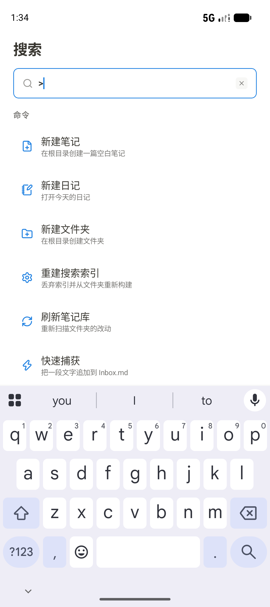
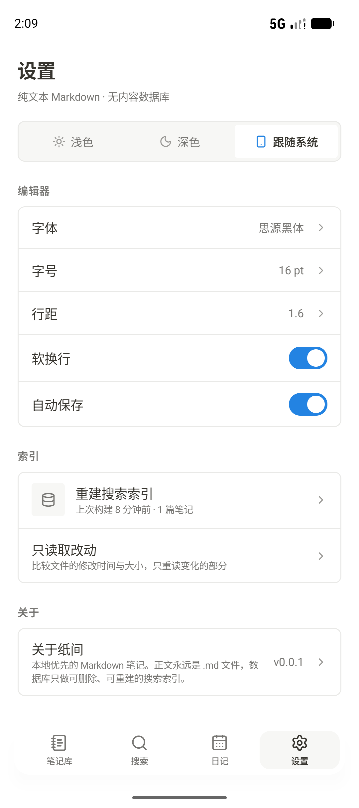
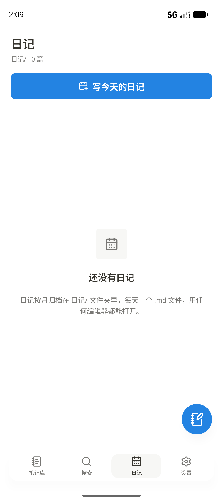

<div align="center">

# 纸间 · MyNote

**本地优先的 Markdown 笔记应用。正文永远是一个个 `.md` 文件，存在你自己的文件夹里。**

[](https://github.com/mariamjensen42-glitch/MyNote/actions/workflows/android.yml)
[](LICENSE)
[-3DDC84.svg)](app/build.gradle.kts)
[](https://kotlinlang.org)

</div>

---

## 这是什么

一个 Android 上的 Markdown 笔记本。它不做云端、不做账号、不做内容数据库 —— 你选一个文件夹，笔记就是那个文件夹里的 `.md` 文件：

- 用任何编辑器都能打开，同步工具（Syncthing、Git、网盘）照常工作；
- 应用只维护一份**可删除、可重建**的搜索索引，索引没了，笔记一个都不会少；
- 卸载应用不会带走任何一篇笔记。

界面与交互按一份 Pencil 设计稿（`.pen`）实现，配色、字号、间距、圆角都取自设计稿里的变量。

## 截图

| 选择仓库 | 笔记库 | 文件夹树 |
|:---:|:---:|:---:|
|  |  |  |

| 编辑器 | 搜索 | 命令面板 |
|:---:|:---:|:---:|
|  |  |  |

| 设置 | 日记 |
|:---:|:---:|
|  |  |

## 功能

**笔记库**
- 列出仓库里所有 `.md` / `.markdown` 文件，显示标题、摘要、相对时间与标签
- 筛选：全部 / 最近（7 天内）/ 标签 / 收藏 / 文件夹
- 排序：最近更新、最早更新、标题、创建时间；置顶的笔记始终浮在最上面
- 长按出操作条：置顶、重命名、移动、删除
- 新建笔记与新建文件夹都建在**仓库根目录**（不跟随当前筛选的文件夹），新建文件夹会先问名字

**编辑器**
- 三种视图：`编辑`（带 Markdown 语法着色的源码）、`分屏`、`预览`，切换器在标题栏右侧
- 等宽源码 + 断点自动保存（可在设置里关闭，关闭后退出编辑时落盘）
- 格式工具条（设计稿的九个动作）：标题、加粗、斜体、无序列表、任务、引用、代码、链接、图片，直接作用于选区（可跨行）；键盘弹起时工具条上移到键盘之上
- 写作时的手感：回车自动续写列表 / 任务 / 引用 / 有序列表（有序号自增，空项回车结束列表）；Tab / Shift+Tab 对选中行缩进与反缩进；「任务」按钮在选中行已是任务时切换勾选状态
- 源码着色与预览同源：`~~删除线~~`、Setext 标题（`===`）、分隔线、行内代码、裸链接都会着色，行内代码里的 `**` 不会被误加粗，`snake_case` 不会被误当斜体
- 预览可交互：点任务复选框直接勾掉（改写源码里那一行），点链接与裸链接交给系统打开；GFM 表格按对齐渲染
- 图片会真的显示出来：`` 这类**仓库内相对路径**（按笔记所在目录解析，`/` 开头表示仓库根）走 SAF 读原图，`` 走网络取图；两者都做等比缩放与内存缓存，读不到就退化成 alt 文字而不是叉图。夹在文字中间的行内图片同样渲染成图，放不下时自动换行
- 工具条的「图片」按钮改为**从系统相册选图**：图片被复制进仓库的附件目录（默认 `attachments/`，可在设置里改，第一次用会自动建目录，抽屉里随即能看到这个目录），笔记里写入相对引用（如 ``）。引用总是独占一段（在文字中间或标题末尾插入会另起段落），也不会被插到 front matter 前面；原图不动，同名会加 ` 2`、` 3` 后缀而不是覆盖
- front matter 就在正文里：`tags` / `pinned` / `favorite` / `aliases` 随写随改；未知字段原样保留
- 字号 / 行距 / 软换行（设置里的三项）对源码区与预览同时生效；软换行关闭时源码区横向滚动而不是折行
- 文件名与保存状态指示（`已保存` / `保存中` / `未保存`）

笔记的重命名与删除在笔记库的长按操作条里，编辑器只负责写。

**搜索与命令面板**
- 同一个输入框：输入 `>` 切到命令面板（新建笔记 / 日记 / 文件夹、重建索引、刷新、快速捕获、切换主题、打开设置）
- 结果按**命中字段**排序：标题命中优先于标签，标签优先于正文
- 命中片段高亮，并标注 `标题 / 内容 / 标签` 与所在文件夹
- 中文子串搜索（见下文「为什么不用 FTS」）

**文件夹树**
- 抽屉形式，展开 / 折叠、每层笔记数、按日期筛选
- 显示上次刷新时间与「N 处外部修改」—— 即被其他应用或同步工具改动过的文件数
- 新建文件夹 / 新建笔记

**快速捕获**
- 系统分享目标（`ACTION_SEND`）与划词菜单（`ACTION_PROCESS_TEXT`）
- 收到文字后可编辑，再选择「追加到 Inbox.md」或「新建笔记」

**日记**
- `日记/yyyy-MM-dd.md` 约定，按月分组；一键打开（不存在则创建）今天的日记

**设置**
- 仓库切换与断开、本地文件用量
- 主题：浅色 / 深色 / 跟随系统
- 编辑器：字体（作用于界面与预览，编辑区按设计稿固定等宽）、字号、行距、软换行、自动保存、附件目录
- 索引：重建（全量）与只读取改动（增量）

## 技术栈

| | |
|---|---|
| 语言 / 构建 | Kotlin 2.2.10 · AGP 9.3.3（内置 Kotlin）· Gradle 9.5 · KSP 2.3.12 |
| UI | Jetpack Compose（BOM 2026.09.00）· Material 3 仅作承载，视觉全部走自定义 token |
| 架构 | MVI + 分层（`core` / `data` / `domain` / `ui`），单 `StateFlow` 状态对象 |
| DI | Hilt 2.60.1（`@Binds` 绑定仓库接口，Dispatcher 走限定符注入） |
| 存储 | Storage Access Framework（`DocumentsContract`）· Room 2.8.5（索引）· DataStore 1.2.1（偏好） |
| 导航 | Navigation Compose 2.10.1，返回栈按 tab 保存 / 恢复 |
| SDK | minSdk 31（Android 12）· targetSdk 36 · compileSdk 37.1 |
| 测试 | JUnit4，82 个单元测试，0 失败 |

## 架构

```
app/src/main/java/com/cycling/mynote/
├── core/                  不含 Android 依赖的纯 Kotlin
│   ├── model/             领域模型（Note、FrontMatter、FolderNode、SearchHit、EditorSettings…）
│   ├── error/             DataError —— UI 需要区别对待的失败
│   └── util/              相对时间格式化、字节数格式化
├── markdown/              Markdown 子系统：纯 Kotlin，零 Compose / 零 Android
│   ├── MarkdownSyntax.kt      语法唯一来源（各构造的正则与标记字面量）
│   ├── MarkdownImages.kt      图片引用的解释（在线 / 仓库内 / 读不到）
│   ├── MarkdownDocument.kt    解析后的模型（InlineSpan / MarkdownBlock）
│   ├── MarkdownParser.kt      块级解析（含 GFM 表格）
│   ├── InlineMarkdownParser.kt 行内扫描（唯一一份行内实现）
│   ├── FrontMatterParser.kt   front matter 读写
│   ├── MarkdownText.kt        标题 / 摘要 / 统计 / 搜索正文（唯一一份纯文本投影）
│   ├── MarkdownSourceEditor.kt 源码级编辑（勾选、回车续写、缩进）
│   └── MarkdownCommands.kt    工具条的九个动作（纯函数，可单测）
├── data/                  实现层
│   ├── saf/               DocumentTreeStore：全部 SAF 读写
│   ├── attachment/        NoteAttachments：把相册选中的图片复制进附件目录
│   ├── image/             NoteImageLoader：SAF 或网络取图、解码缩放、内存缓存
│   ├── index/             Room 索引与索引维护
│   ├── repo/              扫描、路径解析、会话、默认位置
│   ├── prefs/             DataStore
│   ├── share/             系统分享的交接
│   └── repository/        仓库实现（Note / Repo / Search / Settings）
├── domain/repository/     仓库接口 —— 依赖倒置的边界
├── di/                    Hilt 模块
└── ui/
    ├── mvi/               MviViewModel：事件进、状态出、副作用走 Channel
    ├── theme/             MyNoteTheme.colors / .text / .dimens
    ├── icons/             由 tools/icons 生成的 64 个 Lucide 图标
    ├── components/        可复用组件文件（行、按钮、标签、搜索框、弹窗…）
    ├── markdown/          Markdown 的 Compose 侧：预览渲染与源码语法高亮
    ├── navigation/        路由与图
    └── library/ editor/ search/ diary/ settings/ capture/ onboarding/    各屏幕
```

**权限。** 应用只声明了一个权限：`INTERNET`，用途只有一个——把笔记里写的 `http(s)` 图片取回来显示。仓库的读写走系统文件夹授权（SAF），不需要存储权限；其余一切都在本地完成。

**MVI 的取舍。** 状态是**一个不可变对象**而不是若干条独立流 —— 分开的流会让某一帧渲染出「新的笔记列表 + 旧的加载标志」。副作用（导航、提示）走 `Channel` 而不是状态，因为状态会在配置变更时重放，导航重放一次就多跳一屏。

**分层的边界。** `domain` 只有接口，`data` 只有实现，`ui` 只依赖接口。因此换掉底层存储不影响任何一个 ViewModel；`core` 与 `markdown` 全是不含 Android 依赖的纯 Kotlin，可以直接在 JVM 单测里跑——`ui/markdown/` 里的两个文件是这套能力的 Compose 出口（预览渲染、源码高亮），也是唯一依赖 Compose 的 Markdown 代码。

**为什么 Markdown 单独成包。** 同一套语法此前散落在四个包里，最多的一处被写了 8 遍，并且已经开始互相矛盾：高亮器把行内代码里的 `**` 当强调加粗、把 `snake_case` 当斜体，而搜索索引用的是第二份「行内解析器」，与预览渲染看到的文本可以不一致。现在行内只有 `InlineMarkdownParser` 一份实现，块级与行内共用的语法都在 `MarkdownSyntax`，高亮与预览读同一个解析结果，纯文本投影与索引正文都走 `MarkdownText`。

## 几个关键决定

这些是实现时真正需要权衡、且结果影响较大的地方，都写在了对应代码的注释里。

**为什么直接用 `DocumentsContract` 而不是 `DocumentFile`。**
`DocumentFile` 的几乎每个问题都要单独走一次 provider 查询。列出 100 个文件的文件夹，它是 100 次 IPC；`buildChildDocumentsUriUsingTree` 加一次游标查询是 1 次。而应用每次刷新都会重扫整个仓库，这个差别是决定性的。

**为什么笔记用「仓库内相对路径」而不是 SAF document id 作为主键。**
重新授权同一个文件夹时，document id 会换一批，路径不会。索引用路径作主键，用户换一次授权就不用重建索引。

**为什么不用 FTS 而用 `LIKE '%词%'`。**
笔记正文主要是中文，而 SQLite 的 FTS4 分词器（`simple` / `unicode61`）**不切分中文** —— 搜「索引」会被当成一个整 token，只有连续出现才命中。子串匹配对中文是正确的，而个人规模的仓库在一列上做扫描并不是瓶颈。这个取舍是刻意且可逆的：索引本来就是随时可删可重建的，将来换成 FTS 表只需重建，不需要迁移。

**为什么不带字体文件。**
设计稿的正文是 Inter，但稿子里绝大多数是中文，会回落到系统中文字体；如果只打包一个拉丁字形子集，中英混排会明显不一致。而系统的中文字体本身就是思源黑体 —— 正是设计稿「字体」那一项写的名字。因此字体全用平台族，并且做成可选项。

**未知 front matter 字段原样保留。**
解析器只理解 `title` / `tags` / `aliases` / `pinned` / `favorite` / `created` / `updated`，其余键按原始行存下来再原样写回。用别的工具往笔记里写元数据，在本应用里打开并保存一次不会被抹掉。

**默认仓库位置。**
首次启动默认指向 `Documents/Notes`：先通过 MediaStore（无需权限）把目录建出来，再把系统选择器**预导航**到该目录，用户确认一次即可。

Android 不允许应用在未经用户确认的情况下取得共享存储某个文件夹的持久读写权 —— 这正是分区存储的意义，没有绕过的方式。因此这一步无法省掉，但可以做到只剩一次确认。这里还踩过一个坑：`EXTRA_INITIAL_URI` 必须传 **document URI**（`buildDocumentUri`），传 tree URI 会让选择器落在存储卷根目录并且提示「无法使用此文件夹」。

**新建文件后立刻重扫不可靠。**
刚创建 `Inbox.md` 就列目录，provider 对存储卷的视图会滞后，扫出来是空仓库。因此新建的内置文件按已知 id 直接入索引，再对目录列表做有限次重试。

**`Compose` 里的 Markdown 语法着色用 `VisualTransformation` + `OffsetMapping.Identity`。**
恒等映射意味着着色纯粹是装饰：光标、选区、正在输入的字符都不受某个 token 是否被高亮影响。前提是不增删字符 —— 这也是这里恒等映射正确的原因。

**图标是生成的，不是依赖。**
应用只画 64 个图标，为此引入一个 Compose 图标库会打进上千个 `ImageVector`。`tools/icons/gen-icons.js` 拉取对应的 Lucide SVG，逐个元素转换成 `ImageVector`（`node tools/icons/gen-icons.js`）。生成期会校验坐标，遇到解析不了的数据直接失败 —— 早期的 bug 正是静默产出了 `NaN` 坐标。

## 构建

需要 JDK 17+ 与 Android SDK（`compileSdk 37.1`）。`local.properties` 里指向 SDK：

```properties
sdk.dir=/path/to/Android/Sdk
```

```bash
# 单元测试
./gradlew :app:testDebugUnitTest

# 调试包
./gradlew :app:assembleDebug
# 产物：app/build/outputs/apk/debug/app-debug.apk

# 正式包（需要签名配置，见下）
./gradlew :app:assembleRelease
# 产物：app/build/outputs/apk/release/app-release.apk
```

重新生成图标（可选，产物已入库）：

```bash
node tools/icons/gen-icons.js
```

### 签名发布

正式包开启 R8（压缩、混淆、优化）与资源压缩，体积从调试包的 36 MB 降到约 2.9 MB。

签名材料**不进仓库**：`keystore.properties` 已被 `.gitignore` 忽略，其中指向的 keystore 建议
放在仓库之外。没有这个文件时，`assembleRelease` 依然能跑通，只是产物未签名 —— 这样 CI 和任何
克隆仓库的人都能构建，而只有持有密钥的人能产出可发布的包。

首次准备自己的密钥：

```bash
keytool -genkeypair -v \
  -keystore ~/.android-keystores/mynote-release.jks \
  -alias mynote -keyalg RSA -keysize 4096 -validity 10000 \
  -storetype PKCS12

cp keystore.properties.example keystore.properties
# 然后编辑 keystore.properties，填入上面的路径与两个密码（PKCS12 下两者相同）
```

> **务必备份 keystore 与密码**（密码管理器 + 离线副本）。密钥一旦丢失，就无法再以同一个身份
> 为已经分发出去的 app 发布更新。

## 测试

118 个单元测试全部跑在 JVM 上，覆盖最容易写错、也最值得钉死的部分：

| 测试 | 覆盖 |
|---|---|
| `FrontMatterParserTest` | flow / 块状列表、未知键保留、引号规则、往返一致、CRLF |
| `MarkdownTextTest` | 标题优先级、摘要跳过标题与代码块、行数 / 字数、搜索正文的标记剥离 |
| `InlineMarkdownParserTest` | 强调嵌套（`**a *b* c**`）、代码段内不解析、转义、未闭合标记按字面输出、裸链接、源码区间 |
| `MarkdownParserTest` | 标题、任务列表、缩进嵌套、围栏代码、引用、分隔线、GFM 表格（对齐、补列 / 截列）、非表格降级为段落 |
| `MarkdownSourceEditorTest` | 任务勾选、回车续写各类列表、空项结束列表、Tab / Shift+Tab 缩进 |
| `MarkdownCommandsTest` | 工具条九个动作对选区的作用，含行标记的开关语义 |
| `MarkdownImagesTest` | 图片引用的解释：相对路径按笔记目录解析、`..` 不能越出仓库、`%20`、仓库外地址 |
| `TreeEntryFactoryTest` | 抽屉展开 / 折叠、深度、根目录笔记始终可见、排序 |
| `RelativeTimeFormatterTest` | 三种相对时间样式；「昨天」按日历天而不是 24 小时 |
| `ByteSizeFormatterTest` | 单位与小数位 |
| `MyNoteIconsTest` | 每个图标都能构建、视口一致、多元素图标按元素计路径 |

## 图标与许可

应用图标集来自 [Lucide](https://lucide.dev)（ISC 许可），经 `tools/icons/gen-icons.js` 转换为 Compose `ImageVector`。

本项目采用 [MIT 许可](LICENSE)。

## 已知限制

诚实列一下目前**没有**做的：

- **预览还不支持 HTML 与脚注**。解析器覆盖标题、段落、列表、任务、引用、围栏代码、分隔线、GFM 表格（含对齐）、裸链接自动识别与图片；其他语法会降级成段落显示，不会丢字。
- **表格单元格里的图片仍是 `[alt]` 文字**：行内的图片会在段落、标题、列表与引用里渲染成图，表格是固定列宽的网格，图片留在里面只会把表压变形。
- **仓库外的地址读不到**：`/sdcard/…`、`file://`、`content://` 都只能显示 alt，因为应用只被授权了那个仓库文件夹；在线图片也只支持 `http`/`https`。
- **只为图片联网**：应用唯一的权限是 `INTERNET`，且仅当笔记里真的写了 `http(s)` 图片时才会发起请求（见下方「权限」）。同名图片被替换后，缓存会继续用旧图直到应用重启。
- **搜索是子串匹配**，没有模糊匹配、没有词干、没有按相关性打分（只有「标题 → 标签 → 正文」的字段优先级 + 时间）。
- **附件只支持图片**：选中的图片会被复制进附件目录（不会移动或删除原图），其他类型的文件还不能作为附件插入；图片也不会从剪贴板粘贴导入。
- **工具条没有「有序列表」按钮**：设计稿的九个图标里就没有它。有序列表可以手打 `1.`，回车会自动续号。
- **同时只能有一个仓库**，没有多库切换。
- **编辑器没有撤销 / 重做**（依赖输入法自身的撤销）。要自己做需要把编辑器的状态 API 从 `TextFieldValue` 换成 `TextFieldState`，是独立一轮的事。
- **搜索正文换成了按解析器提取**：存量索引行的正文要重建索引后才与新的口径一致（设置里的「重建索引」或命令面板里的刷新）。
- **日记只认 `日记/yyyy-MM-dd.md`** 这一种约定；放在 `日记/` 下但命名不符的文件不会出现在日记页。
- **未在真机验证**：开发过程中的设备验证是在 Pixel 10 模拟器上完成的（调试包与开启 R8 的正式包
  都跑过完整流程）。

## 更新日志

见 [CHANGELOG.md](CHANGELOG.md)。
